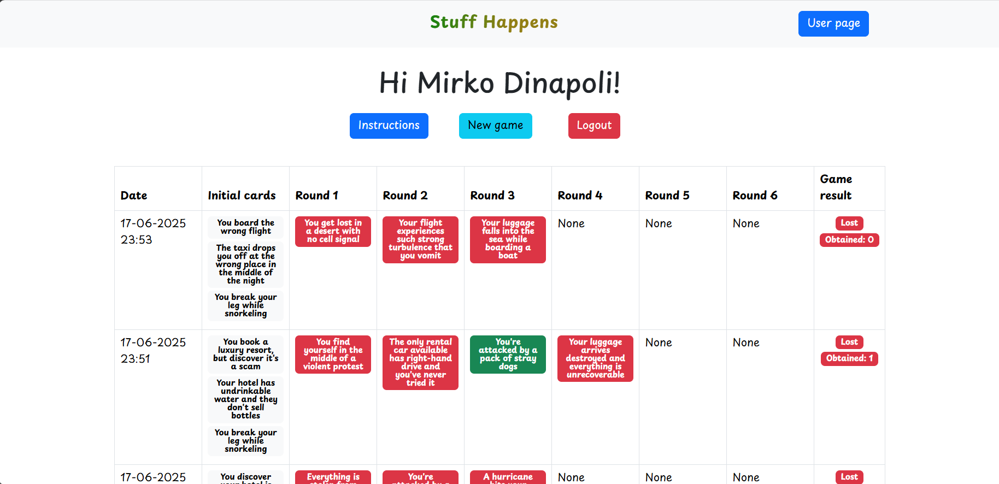
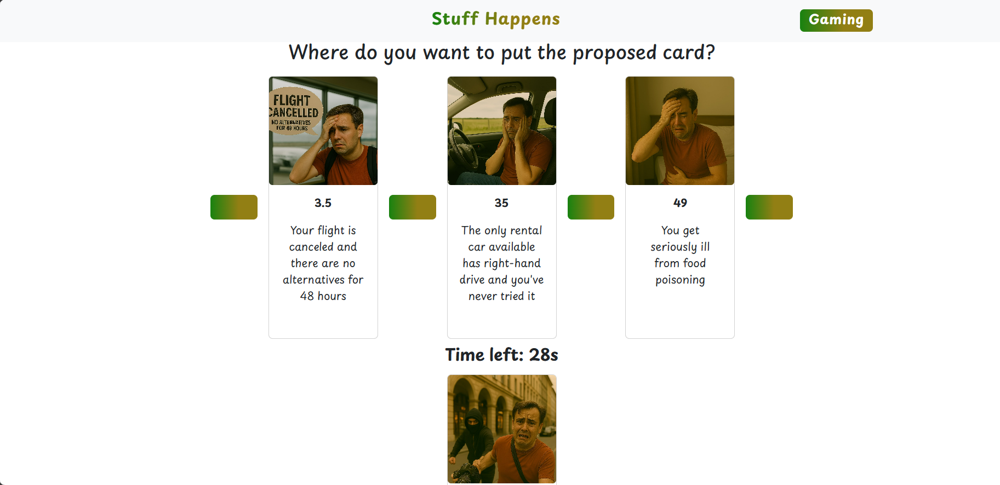

## How to try it
In your terminal write:
```sh
git clone https://github.com/MirkoDinapoli/stuff-happens.git 
cd ...yourProjectDir...
(cd server ; npm install; nodemon index.mjs)
(cd client ; npm install; npm run dev)
```

## React Client Application Routes

- Route `/`: home page - there are three buttons: one to reach the log-in page, one to read instructions and another to start a demo match
- Route `/login`: login page - from there it is possible to log-in
- Route `/instructions`: page whit game instructions
- Route `/demo_game`: page in which it is possible to play a demo match.
- Route `/users/:userID`: :userID is the id associated to that user. This page contains info about previous user matches and a button to start a new one. 
- Route `/users/:userID/instructions`: :userID is the id associated to that user. This page contains game instructions. 
- Route `/users/:userID/game`: :userID is the id associated to that user. This page is the one in which it is possible to play a match. 
- Route `*`: not found page


## API Server
### Images 
- GET `/api/images/:filename` - returns the image file with the given filename.
  - response:  `200 OK` (success), image file as binary data,  `404 Not Found` (not found)

### Authentication management 
- POST `/api/sessions` - logs in the user  
  - response: `201 Created` (success), `401 Unauthorized` (invalid credentials), `500 Internal Server Error` (generic error)
  - request body:
    ```json
    {
      "username": "mirko.dinapoli@polito.it",
      "password": "password"
    }
    ```
  - response body (on success):
    ```json
    {
      "id": 1,
      "username": "mirko.dinapoli@polito.it",
      "name": "Mirko",
      "surname": "Dinapoli"
    }
    ```
- GET `/api/sessions/current` - returns information about the currently authenticated user  
  - request parameters: none
  - response: `200 OK` (success), `304 Not Modified` (not modified), `401 Unauthorized` (not authenticated)
  - response body (on success):
    ```json
    {
      "id": 1,
      "username": "mirko.dinapoli@polito.it",
      "name": "Mirko",
      "surname": "Dinapoli"
    }
    ```
- DELETE `/api/sessions/current` - logs out the currently authenticated user  
  - request parameters: none
  - response: `200 OK` (success), `500 Internal Server Error` (generic error)
  - response body: none

### Game management
- GET `/api/users/<userID>/games` - returns games played by userID
  - request parameters: userID
  - response: `200 OK` (success), `401 Unauthorized` (not authorized), `500 Internal Server Error` (generic error)
  - response body:
    ```json
    [{
      "gameID": 1,
      "date": "20-06-2025 11:00",
      "cards": [
        {
          "cardID":3,
          "description": "You get seriously ill from food poisoning",
          "url": "./data/img/3.png",
          "index": "undefined",
          "round": 0, 
          "is_won": false
        }, 
        {
          "cardID": 5,
          "description": "You get lost in a city where no one speaks your language",
          "url": "./data/img/5.png",
          "index": "undefined",
          "round": 0, 
          "is_won": false
        }, 
        {
          "cardID": 7,
          "description": "Your hotel is overbooked and has no rooms available",
          "url": "./data/img/7.png",
          "index": "undefined",
          "round": 0, 
          "is_won": false
        },
        {
          "cardID": 2,
          "description": "Your boat tour ends with terrible seasickness",
          "url": "./data/img/2.png",
          "index": "undefined",
          "round": 1, 
          "is_won": false
        },
        {
          "cardID": 10,
          "description": "The bathroom in your room doesn't work and the hotel is fully booked",
          "url": "./data/img/10.png",
          "index": "undefined",
          "round": 2, 
          "is_won": false
        },
        {
          "cardID": 14,
          "description": "You get stung by a sea urchin and have to stop diving",
          "url": "./data/img/14.png",
          "index": "undefined",
          "round": 3, 
          "is_won": false
        }],
      "is_won": false
    }]
    ```
- POST `/api/users/<userID/games/new` - returns cards and gameID to client to start a new game. On the server side it updates the database with new game info
  - request parameters: userID
  - response: `200 OK` (success), , `401 Unauthorized` (not authorized),`500 Internal Server Error` (generic error)
  - request body: none
  - response body: 
    ```json
    {
      "gameID": 1,
      "cards": [
      {
        "cardID":2,
        "description": "Your boat tour ends with terrible seasickness",
        "url": "./data/img/2.png", 
        "index": 13
      }, 
      {
        "cardID":4,
        "description": "You're arrested due to a misunderstanding with local police",
        "url": "./data/img/4.png", 
        "index": 81
      }, 
      {
        "cardID":7, 
        "description": "Your hotel is overbooked and has no rooms available",
        "url": "./data/img/7.png", 
        "index": 7
      }]
    }
    ```
- GET `/api/users/<userID>/games/<gameID>/rounds/<roundID>/new_round` - return a new unseen card, without index, to start a new round
  - request parameters: userID, gameID and roundID
  - response: `201 OK` (success), `500 Internal Server Error` (generic error)
  - request body: none
  - response body: 
    ```json
    {
      "card": {
        "cardID":6,
        "description": "You get badly sunburned on the first day of vacation",
        "url": "./data/img/6.png"
      }
    }
    ```
- PATCH `/api/users/<userID>/games/<gameID>/rounds/<roundID>/end_round` - client sends the range of bad luck indexes selected by user and server sends back the outcome, checking if the user has fullfilled the timing constraint and if the round is the last in the game.
  - request parameters: userID, gameID and roundID
  - response: `200 OK` (success), `422 Unprocessable entity` (error in body of request), `500 Internal Server Error` (generic error)
  - request body: 
    ```json
    {
      "upperIndex": 40,
      "lowerIndex": 50, 
    }
    ```
  - response body: 
    ```json
    {
      "is_won": true,
      "index": 43,
      "is_game_ended": false,
      "is_game_won": false
    }
    ```


### Demo game management
- POST `/api/demo_game/new` - returns cards to client and gameID to start a new game. On the server side it updates the database with new game inf
  - response: `200 OK` (success), `422 Unprocessable entity` (error in body of request), `500 Internal Server Error` (generic error)
  - request body: none
  - response body: 
    ```json
    {
      "gameID": 1,
      "cards": [
      {
        "cardID":2,
        "description": "Your boat tour ends with terrible seasickness",
        "url": "./data/img/2.png", 
        "index": 13
      }, 
      {
        "cardID":4,
        "description": "You're arrested due to a misunderstanding with local police",
        "url": "./data/img/4.png", 
        "index": 81
      }, 
      {
        "cardID":7, 
        "description": "Your hotel is overbooked and has no rooms available",
        "url": "./data/img/7.png", 
        "index": 7
      }]
    }
    ```
- POST `/api/demo_game/new_round` - server sends a new unseen card without index, to start a new round
  - response: `200 OK` (success), `422 Unprocessable entity` (error in body of request), `500 Internal Server Error` (generic error)
  - request body: 
    ```json
    {
      "gameID" : 1
    }
    ```
  - response body: 
    ```json
    {
      "card": {
        "cardID":6,
        "description": "You lose your passport on the first day of vacation",
        "url": "./data/img/6.png"
      }
    }
- POST `/api/demo_game/end_round` - client sends the range of bad luck indexes selected by user and server sends back the outcome, checking if the user has fullfilled the timing constraint.
  - request parameters: userID, gameID and roundID
  - response: `200 OK` (success), `422 Unprocessable entity` (error in body of request), `500 Internal Server Error` (generic error)
  - request body: 
    ```json
    {
      "gameID": 1, 
      "upperIndex": 40,
      "lowerIndex": 50, 
    }
    ```
  - response body: 
    ```json
    {
      "is_won": true,
      "index": 43
    }
    ```
- DELETE `/api/demo_game/delete` - delete all entries related to demo games from the database
  - request parameters: none
  - response: `200 OK` (success), `500 Internal Server Error` (generic error)
  - response body: none


### Error management
In case of errors inside the server, it returns a string specificng error details. 

## Database Tables

- Table `users` - contains: id username name surname password sale
- Table `cards` - contains: cardID description bad_luck_index url
- Table `games` - contains: gameID userID date is_won
- Table `used_cards` - contains: gameID cardID round_number is_won start_date

## Main React Components
- `NavHeader` (in `NavHeader.jsx`)
- `Home` (in `Home.jsx`)
- `Game` (in `Game.jsx`)
- `DemoGame` (in `DemoGame.jsx`)
- `DuringGame` (in `GameComponents.jsx`)
- `EndGame` (in `GameComponenets.jsx`)
- `UserPage` (in `UserPage.jsx`)

## Screenshot




## Users Credentials

- mirko.dinapoli@polito.it, password (he has played)
- mario.rossi@gmail.com, password_ (he has never played)
